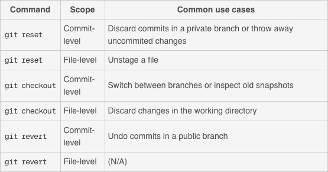

# GitR Done

* First, an explanation for the best way to go about setting up git with an R project
* Then, useful git commands, especially for undoing things with `checkout`, `reset`, and `revert`

 

### *Git in R*

##### From RStudio

* Make sure the R script is in its own directory
* Create an Rproj in that directory:
	* Either in a shell
		* `touch .Rproj`
	* Or in RStudio
		* File > New Project > Existing Directory
	* That should make version control features available for that directory
	* You should see a Git tab next to Environment and History in the top right pane and files in the Files tab (bottom right pane)
* If you don't see the Git tab, try opening the Rproj file. It should open in a new RStudio window.		
* Add *.Rproj and .DS_Store to the .gitignore	

		
##### Initialize the repo and add files
* In the shell, navigate to the directory
* Initialize a repository in there
	* `git init`
	* Check it with `git status`

* In the directory, make a README.md in Mou

* Add and commit all files in the directory
	* `git add .` 
		* (Note that `git add *` won't add files beginning with `.`, so you'd have to `git add .gitignore` by hand. By contrast, `git add .` *will* add your gitignore)
	* Check you've got all the files you want and none of the ones you don't with `git status`
	* `git commit -m "initial commit"`  
	

	
##### Add a remote

* Create repo on GitHub
	* Add a description
	* **Don't** add a readme or a gitignore
		* If you do, you'll have to pull these from the remote to master, add them, and then push them back to origin because they're upstream of master

* Add the remote from the shell
	* `git remote add origin <github url>`
		* This names the remote "origin"
* Check that it's set up correctly to fetch and push
	* `git remote -v`

* Push everything to remote
	* `git push -u origin master`

  

***

  

### *Typical git workflow*

* Make an experimental branch and switch to it
	* `git checkout -b experimental`
* Check which branch you're on
	* `git branch`
* Make changes on experimental branch
* Merge changes back to master
	* Get on master branch
		* `git checkout master`
	* Merge changes from experimental to master
		* `git merge experimental`
* Check out diffs
	* `git diff`
	* Or in RStudio, hit the diff butt in the top right pane 
* Add and commit everything and push it to remote
	* `git add .`
	* `git commit -m "commit message"`
	* `git push -u origin master`
	
  

	
***

  

	
### *Generally useful git things*

* Make a .gitignore
	* `touch .gitignore`
	* `open .gitignore`
* Push the experimental branch to remote repo
	* `git push -u origin experimental`
		* (Only need the `-u` for "upstream" the first time)
	* This creates a branch called experimental on the remote repo and pushes to that
	* Refer to remote repos as `origin/master` and `origin/experimental`

* Move files to an enclosing directory
	* `mkdir new_directory`
	* `git mv <file_to_move_1> <file_to_move_2> <new_directory>` 
		* (For files not tracked by git you drop the `git`)
		* [More complete explanation](https://githowto.com/moving_files) of why you need the `git` at the beginning for files tracked by git
	* Alternatively, you can do `mv <file_to_move_1> <file_to_move_2>  ./git <new_directory>` because this also moves your hidden git directory

* Refering to commits without commit hashes
	* `git checkout HEAD~1` is "HEAD minus 1" commit, `git checkout HEAD~2` is "HEAD minus 2" commits, etc.
	* `^` means "the parent of"
	* You can also [tag versions](https://githowto.com/tagging_versions)
	* If you do use a commit hash, you only need the first few characters of the hash

	
* Work with vim
	* After `git diff`
		* `:wq`
	* After `git commit`, write commit message, then 
		* Escape + `:wq` 

	
 

***

#### Command+Z, Command+Z, Command+Z

* Completely throw away your uncommitted changes
	* `git reset --hard HEAD`

 

For everything else...there's MasterCard. Or rather, [one of many tutorials](https://www.atlassian.com/git/tutorials/resetting-checking-out-and-reverting/file-level-operations).  

 

***Common use cases***

**File level**

* File *staged*
	* Unstage it. Don't change what's in the working direcotry.
	* `git reset HEAD <file>`
	* Adding `--soft` or `--hard` here doesn't do anything since you've included `<file>`. When you do that, the staged snapshot is always updated but the working directory is never updated.
* File *unstaged* (maybe you just unstaged it with the above or you never staged it in the first place)
	* Undo changes in working directory 
	* `git checkout HEAD <file>`

  

**Commit Level**

* Undo the last few commits
	* `git reset --hard HEAD~2`
	* The commits you made after HEAD~2 will be thrown away when git does garbage collection
* Undo the last few commits by creating a new commit
	* `git revert HEAD~2`
		* Make a new commit that is the same as `HEAD~2` 
		* This doesn't alter any commit history, it just tacks on a new commit to the end

 

**Other**

* Remove a file that should have been on .gitignore but wasn't
	* `git rm --cached <file name>`
	* need `git rm -r --cached <directory>` if it's a directory (`-r` for recursively)
	
* Delete a repo
	* On GitHub: click the settings gear and scroll to the bottom to the "Danger Zone"
	* Locally: `rm -fr .git`

 

***	

  

##### More in depth on `checkout`, `reset`, and `revert`

* Checkout
	* Moves HEAD to any stage in the commit history
	* `git checkout <commit hash> <file>`
		
	* [Remember](http://swcarpentry.github.io/git-novice/05-history/) that if you don't add  `<file>` you'll be in the detached HEAD state
		* Don't start creating commits here until you create a new branch 

 

* Reset
	* For undoing things on private branches
	* Throw away uncommited changes
		* `git reset --hard HEAD`
	* Move back to the previous commit
		* `git reset HEAD^` (same as `git reset HEAD~1`) 
		* Default is `--mixed`
			* "Keep the working directory the same. Unstage all the changes I made since the last commit."
		* `--hard`
			* "Change the working directory and the staged snapshot to the specified commit." This throws away all uncommitted changes.

 

* Revert
	* For undoing committed changes on public branches
	* Undo a commit by creating another commit
		* Doesn't rewrite the commit history like `git reset` does

	
 

* Remember that `git checkout` and `git reset` do different things at the commit level and the file level
	* i.e., whether you include a file path as a parameter 
	* (`git revert` doesn't have a file-level counterpart)
	

 

In sum:

    

***
##### Online resources
* [General git tutorial](https://git-scm.com/docs/gittutorial)

* [Version control in RStudio](https://support.rstudio.com/hc/en-us/articles/200532077-Version-Control-with-Git-and-SVN)

* [Jenny Bryan's short explanation](https://jennybc.github.io/2014-05-12-ubc/ubc-r/session03_git.html) [and woah a long one](http://happygitwithr.com/)

***
